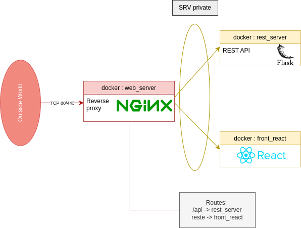
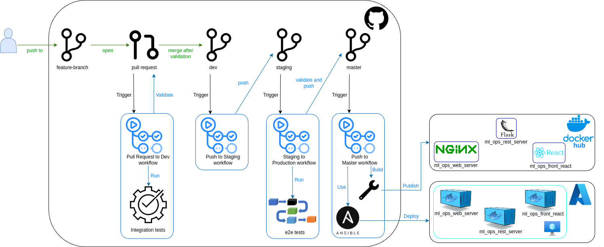

# ML OPS PROJECT

## Docker organisation



## Github pipeline



## Connecting to the DVC Repository

### Steps to Configure DVC with Azure Blob Storage

1. **Add a Remote Storage**
   
   Use the following command to add and set a default remote storage:
   ```bash
   dvc remote add -d myremote azure://<blob storage>
   ```
   Replace `<blob storage>` with the appropriate path to your Azure Blob Storage container.

2. **Modify Remote Storage with Account Details**

   Update the remote storage configuration with your Azure Storage account details:
   
   - Set the storage account name:
     ```bash
     dvc remote modify myremote account_name <storage account name>
     ```
     Replace `<storage account name>` with your actual Azure Storage account name.

   - Set the storage account key:
     ```bash
     dvc remote modify myremote account_key <storage account key>
     ```
     Replace `<storage account key>` with the key associated with your Azure Storage account.

## Run locally

### Model training 

- Pull all the necessary data from the azure blob storage.
  ```bash
  dvc pull
  ```
- Run the notebook in the `model_training` directory.

### Application

- Run the following commands :
  ```bash
  dvc pull app/backend/model/gradient_boosting.pkl.dvc
  
  cd app

  docker-compose up -d --build
  ```
- Access website at : [http://localhost](http://localhost)
- Call API using : 
  ```bash
  curl -X POST http://localhost/api/predict \
    -H "Content-Type: application/json" \
    -d '{
        "features": {
            "MSSubClass": 60,
            "LotFrontage": 80.0,
            "LotArea": 9600,
            "OverallQual": 7,
            "OverallCond": 5,
            "YearBuilt": 2003,
            "YearRemodAdd": 2003,
            "GrLivArea": 1710,
            "FullBath": 2,
            "HalfBath": 1,
            "BedroomAbvGr": 3,
            "ExterQual": "Gd",
            "ExterCond": "TA",
            "HeatingQC": "Ex",
            "KitchenQual": "Gd",
            "Neighborhood": "CollgCr",
            "SaleType": "WD",
            "SaleCondition": "Normal",
            "HouseStyle": "2Story"
        }
    }'
  ```
- To stop the containers :
  ```bash
  docker-compose down
  ```

## Accessing online

- Access website at : [http://ml-ops.francecentral.cloudapp.azure.com](http://ml-ops.francecentral.cloudapp.azure.com)
- Call API using : 
  ```bash
  curl -X POST http://ml-ops.francecentral.cloudapp.azure.com/api/predict \
    -H "Content-Type: application/json" \
    -d '{
        "features": {
            "MSSubClass": 60,
            "LotFrontage": 80.0,
            "LotArea": 9600,
            "OverallQual": 7,
            "OverallCond": 5,
            "YearBuilt": 2003,
            "YearRemodAdd": 2003,
            "GrLivArea": 1710,
            "FullBath": 2,
            "HalfBath": 1,
            "BedroomAbvGr": 3,
            "ExterQual": "Gd",
            "ExterCond": "TA",
            "HeatingQC": "Ex",
            "KitchenQual": "Gd",
            "Neighborhood": "CollgCr",
            "SaleType": "WD",
            "SaleCondition": "Normal",
            "HouseStyle": "2Story"
        }
    }'
  ```
